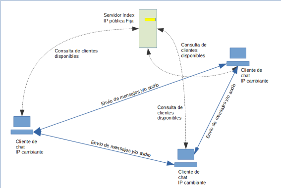

# Example Sockets with python



- ``` file server ``` = is an indexed server that stores clients in an array.
- ``` client file ``` = posee funciones de cliente/servidor de tcp y udp, genera puertos aleatorios para cada uno, cada cliente posee un nombre de usuario y se genera la conexion entre clientes, para enviar archivos se usa protocolo UDP y se envia escribiendo en la terminal ```audio:nombre.ext```.